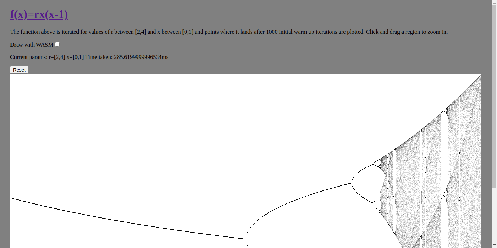

# logistic_chaos_map

Renders the [logistic map](https://en.wikipedia.org/wiki/Logistic_map) using a
canvas and some basic JS. It also implements the same logistic map drawing code
in WASM and js

Demo here https://cmdcolin.github.io/logistic_chaos_map/

## Screenshot



## Build

```
cd logistic_map_wasm
wasm-pack build
cd ..
yarn start
```

Note if you change any wasm code, perform

`rm -rf node_modules/logistic_map_wasm; yarn; yarn start`

This is necessary because when you run `yarn` in the root directory, it copies
logistic_map_wasm/pkg to node_modules/logistic_map_wasm/

Ideally there would be a smoother workflow but we'll get there soon

## Notes

The wasm implementation was added early 2020. I googled a million times "wasm
create-react-app" and stumbled through tons of stackoverflow threads, and then
found various posts with their published source code referring to their demo
wasm package on NPM ([ex1](https://www.npmjs.com/package/@prichey/hello-wasm)
[ex2](https://www.npmjs.com/package/wasm-koala-blog) those are from popular
wasm-in-create-react-app articles) and I was like, why can I not get a
development local build of this to work without publishing my package?

The takeaway as of right now is that we have to specifically refer to the pkg
folder that wasm-bindgen creates using the syntax "mypackage":
"file:./path/to/pkg" in the create-react-app's package.json. There may be a
better way with the
[wasm-pack-plugin](https://github.com/wasm-tool/wasm-pack-plugin)) but I have
not figured this out quite yet

## Troubleshooting

Before I found this fix noted above I repeatedly ran into errors that said
things like

```
./src/wasm/index_bg.wasm
Module parse failed: magic header not detected
File was processed with these loaders:
 * ./node_modules/wasm-loader/index.js
You may need an additional loader to handle the result of these loaders.
Error: magic header not detected
```

Or

```
TypeError: _index_bg_wasm__WEBPACK_IMPORTED_MODULE_0__.draw is not a function
```

Or

```
TypeError: __webpack_require__.e is not a function
```

Also there was a recommendation to use

```
{
  test: /\.wasm$/,
  type: 'javascript/auto',
  loader: 'file-loader',
}
```

This did not work for me.

The key for me was making the wasm pkg folder a proper dependency in
package.json AND importing that same name that you put in the package.json in
the import statement in your js code.
